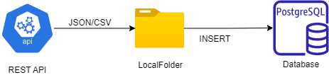

# Airlines
## Project Description
    This project is start with getting response from `RESTAPI` then covert that response in text format for create a
json file. Read data from json file to convert json file into csv file. For creating database table first intailize the connection, then move data from csv file to `stg_airlines` table. Now Data in stg_airlines table,for day to day refresh data create  airlines table. Before moving data from stg_airlines  to airlines table truncate airlines table.creating sp_airlines procedure to move data from stging table to airlines table.

### Project Data Flow 
